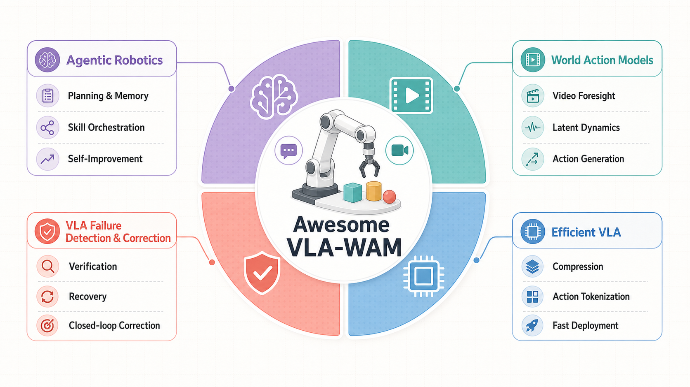
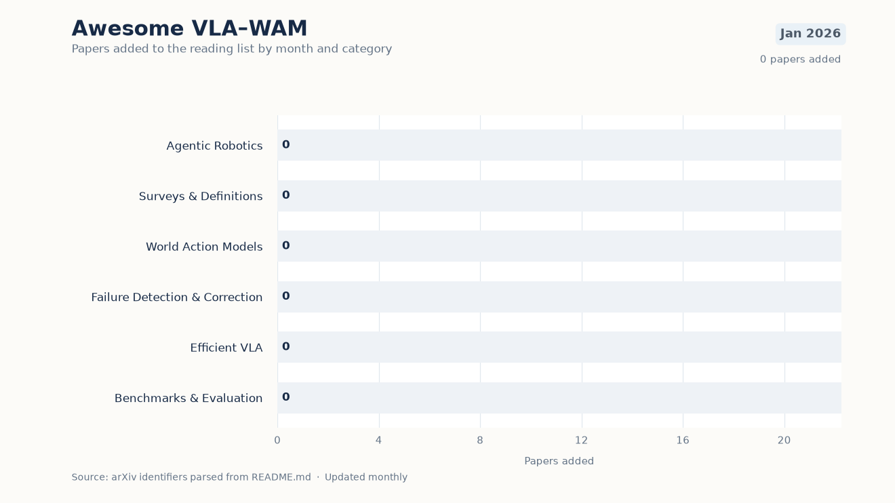

# Awesome VLA-WAM

A curated reading list for Vision-Language-Action (VLA), World Action Model
(WAM), and agentic robotics research, organized around four active directions:

- Agentic robotics for embodied agents that coordinate multi-step physical
  tasks through planning, memory, tool or skill composition, and self-improvement.
- World Action Models for robotics.
- Failure detection, correction, feedback, and recovery in VLA systems.
- Efficient VLA models, action tokenization, compression, and deployment.

  

  

The animation tracks papers added since January 2026 and is regenerated from
the arXiv identifiers in this README with
[`scripts/generate_monthly_paper_chart.py`](scripts/generate_monthly_paper_chart.py).

The agentic robotics section requires an explicit embodied-agent layer that
coordinates multi-step physical execution through high-level planning, memory,
tool or skill discovery and composition, VLA/VLM or policy orchestration,
navigation, recovery, or online policy self-improvement. Standalone prompt
optimization, generic exploration, or low-level VLA improvements without this
agent-level role are out of scope.
The failure
detection/correction section is not a one-to-one heading in the source
repository; it groups papers that are closely related through environment
feedback, self-improvement, verification, closed-loop learning, preference
alignment, online planning, or robustness evaluation.

## Contents

- [Agentic Robotics (New Trend)](#agentic-robotics-new-trend) ([full archive](AGENTIC_ROBOTICS.md))
- [Surveys and Definitions](#surveys-and-definitions)
- [World Action Models](#world-action-models) ([full archive](WORLD_ACTION_MODELS.md))
- [VLA Failure Detection and Correction](#vla-failure-detection-and-correction) ([full archive](VLA_FAILURE_DETECTION_AND_CORRECTION.md))
- [Efficient VLA](#efficient-vla) ([full archive](EFFICIENT_VLA.md))
- [Benchmarks for Robustness and Evaluation](#benchmarks-for-robustness-and-evaluation)
- [Contributing](#contributing)

Section badges indicate the last curated refresh date for each category.
The main paper sections below show the latest 10 entries for each direct
list or subsection, sorted by available arXiv date/id. Full retained lists are
kept in the linked archive documents.

Relevance: stars indicate topical relevance only, not paper quality: ⭐⭐⭐ direct fit · ⭐⭐ adjacent/supporting · ⭐ background/context.

## Agentic Robotics (New Trend) 

Full archive: [Agentic Robotics](AGENTIC_ROBOTICS.md).

This emerging line treats robot foundation models as components inside a
broader embodied-agent loop. Papers belong here only when the agent layer is
central to coordinating physical multi-step execution through planning,
memory, tool or skill composition, policy orchestration, navigation, recovery,
or online self-improvement; standalone model or prompt improvements are out of
scope.

| Paper | Title | Links | Relevance |
| --- | --- | --- | --- |
| EAFG | Evidence-Gated Task and Motion Planning with Vision-Language Models. | [arXiv](https://arxiv.org/abs/2608.20084) | ⭐⭐⭐ |
| GuideFetch | GuideFetch: A Task Coordination Framework for Concurrent Navigation and Object Retrieval in Assistive Robot Dogs. | [arXiv](https://arxiv.org/abs/2608.18292) | ⭐⭐⭐ |
| HODAgent | HODAgent: Towards On-Demand, Responsive Humanoids for Physical World Human Interaction. | [arXiv](https://arxiv.org/abs/2608.17584) | ⭐⭐⭐ |
| ART | Evolve Vision-Language-Action Model into an Agent with On-the-fly Tool-use. | [arXiv](https://arxiv.org/abs/2608.14047) | ⭐⭐⭐ |
| Deliberate Practice | Deliberate Practice: Learning Robot Skills under a Budget. | [arXiv](https://arxiv.org/abs/2608.13415) | ⭐⭐⭐ |
| Fast-Slow ReAct Agent | Hierarchical Fast-Slow ReAct Agent for Zero-Shot Object-Goal Navigation. | [arXiv](https://arxiv.org/abs/2608.09816) | ⭐⭐⭐ |
| Coordination Threats | When Coordination Becomes a Threat: Communication Attacks in LLM-Controlled Multi-Robot Systems. | [arXiv](https://arxiv.org/abs/2608.06830) | ⭐⭐⭐ |
| HiRoC | Beyond Flat Policies: Hierarchical Post-Training for Embodied Agents in Robotic Manipulation. | [arXiv](https://arxiv.org/abs/2608.05999) | ⭐⭐⭐ |
| Mimir | Mimir: A Neuro-Symbolic Memory System with Dynamic Grounding for Embodied Agents in Interactive Environments. | [arXiv](https://arxiv.org/abs/2608.04933) | ⭐⭐⭐ |
| ETA | ETA: A New Agentic Paradigm for Embodied Tasks. | [arXiv](https://arxiv.org/abs/2608.03924) | ⭐⭐⭐ |

## Surveys and Definitions 

| Paper | Title | Links | Relevance |
| --- | --- | --- | --- |
| Embodied Brains Roadmap | From World Action Models to Embodied Brains: A Roadmap for Open-World Physical Intelligence. | [arXiv](https://arxiv.org/abs/2607.11689) | ⭐⭐⭐ |
| VLA Review: UAV and Bimanual | Vision Language Action (VLA) Models for Unmanned Aerial Robotics and Bimanual Manipulation: A Review. | [arXiv](https://arxiv.org/abs/2607.06706) | ⭐⭐⭐ |
| World Action Models Tutorial | From World Models to World Action Models: A Concise Tutorial for Robotics. | [arXiv](https://arxiv.org/abs/2607.00836) · [Website](https://clearlab-sustech.github.io/WorldModelSurvey/) · [Code](https://github.com/clearlab-sustech/WorldModelSurvey) | ⭐⭐⭐ |
| World Model for Robot Learning | World Model for Robot Learning: A Comprehensive Survey. | [arXiv](https://arxiv.org/abs/2605.00080) · [Website](https://ntumars.github.io/wm-robot-survey/) · [Code](https://github.com/NTUMARS/Awesome-World-Model-for-Robotics-Policy) | ⭐⭐⭐ |
| Embodied Agentic AI | Towards Embodied Agentic AI: Review and Classification of LLM- and VLM-Driven Robot Autonomy and Interaction. | [arXiv](https://arxiv.org/abs/2508.05294) | ⭐⭐⭐ |

## World Action Models 

Full archive: [World Action Models](WORLD_ACTION_MODELS.md).

### Video-Generation-Based WAM 

| Paper | Title | Links | Relevance |
| --- | --- | --- | --- |
| Surgical WAM | Surgical WAM: A World-Action Model for Data-Efficient Surgical Robot Learning. | [arXiv](https://arxiv.org/abs/2608.11204) | ⭐⭐⭐ |
| SimWAM | SimWAM: A Simple World Action Model for End-to-End Autonomous Driving. | [arXiv](https://arxiv.org/abs/2608.07468) · [Code](https://github.com/H-EmbodVis/SimWAM/) | ⭐⭐⭐ |
| DreamWAM | DreamWAM: Beyond RGB Future Prediction for World Action Models. | [arXiv](https://arxiv.org/abs/2608.04996) · [Code](https://github.com/hustvl/DreamWAM) | ⭐⭐⭐ |
| Robot-Factored World Models | Robot-Factored World Models via Robot Rendering. | [arXiv](https://arxiv.org/abs/2607.22535) · [Website](https://bjkim95.github.io/rofacto/) | ⭐⭐⭐ |
| Masked Visual Actions | Masked Visual Actions for Unified World Modeling. | [arXiv](https://arxiv.org/abs/2607.19343) · [Website](https://masked-visual-actions.github.io/) | ⭐⭐⭐ |
| AeroAct | AeroAct: Action-Centered World-Action Models for Language-Conditioned Quadrotor Flight. | [arXiv](https://arxiv.org/abs/2607.14997) | ⭐⭐⭐ |
| FlowWAM | FlowWAM: Optical Flow as a Unified Action Representation for World Action Models. | [arXiv](https://arxiv.org/abs/2607.13017) · [Website](https://flow-wam.github.io/) | ⭐⭐⭐ |
| LingBot-VA 2.0 | Native Video-Action Pretraining for Generalizable Robot Control. | [arXiv](https://arxiv.org/abs/2607.08639) · [Website](https://technology.robbyant.com/lingbot-va-v2) | ⭐⭐⭐ |
| Temporal Ratio | Understanding and Mitigating the Video-Action Generalization Gap via Temporal Ratio. | [arXiv](https://arxiv.org/abs/2607.08127) · [Website](https://umishra.me/temporal-ratio/) | ⭐ |
| SWAM | Pondering the Way: Spatial-perceiving World Action Model for Embodied Navigation. | [arXiv](https://arxiv.org/abs/2606.29908) | ⭐⭐⭐ |

### VLM-Based WAM 

| Paper | Title | Links | Relevance |
| --- | --- | --- | --- |
| HyWorldVLA | HyWorldVLA: A Vision-Language-Action Model with Hybrid World Modeling for Autonomous Driving. | [arXiv](https://arxiv.org/abs/2607.20988) | ⭐⭐⭐ |
| DSWAM | DSWAM: A Dual-System World Action Foundation Model for Fine-Grained Robot Manipulation. | [arXiv](https://arxiv.org/abs/2607.04927) | ⭐⭐⭐ |
| FutureNav | FutureNav: Unified World-Action Modeling for Vision-and-Language Navigation. | [arXiv](https://arxiv.org/abs/2606.30367) | ⭐⭐⭐ |
| WLA | World-Language-Action Model for Unified World Modeling, Language Reasoning, and Action Synthesis. | [arXiv](https://arxiv.org/abs/2606.05979) · [Website](https://github.com/SJTU-DENG-Lab/WLA) | ⭐⭐⭐ |
| CKT-WAM | CKT-WAM: Parameter-Efficient Context Knowledge Transfer Between World Action Models. | [arXiv](https://arxiv.org/abs/2605.06247) · [Website](https://github.com/YuhuaJiang2002/CKT-WAM) | ⭐⭐ |
| World-Value-Action Model | World-Value-Action Model: Implicit Planning for Vision-Language-Action Systems. | [arXiv](https://arxiv.org/abs/2604.14732) | ⭐⭐⭐ |
| WoG | World Guidance World Modeling in Condition Space for Action Generation. | [arXiv](https://arxiv.org/abs/2602.22010) · [Website](https://selen-suyue.github.io/WoGNet/) | ⭐⭐ |
| VLAW | VLAW: Iterative Co-Improvement of Vision-Language-Action Policy and World Model. | [arXiv](https://arxiv.org/abs/2602.12063) · [Website](https://sites.google.com/view/vlaw-arxiv) | ⭐⭐⭐ |
| VLA-JEPA | VLA-JEPA: Enhancing Vision-Language-Action Model with Latent World Model. | [arXiv](https://arxiv.org/abs/2602.10098) · [Website](https://ginwind.github.io/VLA-JEPA/) | ⭐⭐⭐ |
| MM-ACT | MM-ACT: Learn from Multimodal Parallel Generation to Act. | [arXiv](https://arxiv.org/abs/2512.00975) · [Website](https://github.com/HHYHRHY/MM-ACT) | ⭐⭐ |

### WAM from Scratch and Latent Dynamics 

| Paper | Title | Links | Relevance |
| --- | --- | --- | --- |
| DECOWAM | DECOWAM: Decoupled Whole-Body World-Action Model for Legged Mobile Manipulation. | [arXiv](https://arxiv.org/abs/2608.20114) | ⭐⭐⭐ |
| DA-WAM | DA-WAM: Decision-Aligned Future Latents for Driving World Models. | [arXiv](https://arxiv.org/abs/2608.19085) | ⭐⭐⭐ |
| Hydra-0 | Hydra-0: Action Flow for Generalist World Modeling and Control. | [arXiv](https://arxiv.org/abs/2608.18077) · [Project](https://nvidia-isaac.github.io/video_to_data/hydra-0/) | ⭐⭐⭐ |
| ContactGuard | ContactGuard: Pre-Contact Execution Monitoring with Action-Conditioned Latent World Models. | [arXiv](https://arxiv.org/abs/2608.13438) | ⭐⭐⭐ |
| RIFT | Keep the Future, Drop the Rollout: RIFT for World Action Models. | [arXiv](https://arxiv.org/abs/2608.11521) | ⭐⭐⭐ |
| HarnessWAM | HarnessWAM: Bridging Prediction and Deliberation in World Action Models. | [arXiv](https://arxiv.org/abs/2608.09516) | ⭐⭐⭐ |
| ω-0 | ω-0: A Latent Predictive World Action Model for Concurrent Humanoid Loco-Manipulation. | [arXiv](https://arxiv.org/abs/2608.06375) | ⭐⭐⭐ |
| LiLa-WAM | LiLa-WAM: Lightweight Latent Reasoning World-Action Model for Robotic Manipulation. | [arXiv](https://arxiv.org/abs/2608.03701) | ⭐⭐⭐ |
| CoWAM | CoWAM: Coordination Contracts for Selective Policy Intervention with WAMs. | [arXiv](https://arxiv.org/abs/2608.02580) | ⭐⭐⭐ |
| FBFM | FBFM: A Training-Free Asynchronous Feedback Mechanism for Flow-Matching in World-Action Models Execution. | [arXiv](https://arxiv.org/abs/2607.29235) | ⭐⭐⭐ |

## VLA Failure Detection and Correction 

Full archive: [VLA Failure Detection and Correction](VLA_FAILURE_DETECTION_AND_CORRECTION.md).

These papers are useful entry points for failure-aware VLA systems, especially
when the method uses feedback, online adaptation, closed-loop correction,
self-evaluation, or policy/world-model co-improvement.

| Paper | Title | Links | Relevance |
| --- | --- | --- | --- |
| SafeBranch | SafeBranch: Branch-Pair Safety Alignment for Embodied Agents. | [arXiv](https://arxiv.org/abs/2608.19729) | ⭐⭐⭐ |
| GS-VLA | GS-VLA: Plug-and-Play Viewpoint Canonicalization for Frozen VLA Policies via Gaussian Splatting. | [arXiv](https://arxiv.org/abs/2608.19066) | ⭐⭐⭐ |
| Calibrated Predictive Safety | Calibrated Predictive Safety for Heterogeneous Robots: An Action-Conditioned JEPA Framework with Model-Based Safety Shields. | [arXiv](https://arxiv.org/abs/2608.17496) | ⭐⭐⭐ |
| ViTaR | ViTaR: Visuo-Tactile Residual Adaptation for Foundation VLA Manipulation. | [arXiv](https://arxiv.org/abs/2608.15816) | ⭐⭐⭐ |
| Decoding Task Progress | Decoding Task Progress from VLA Representations. | [arXiv](https://arxiv.org/abs/2608.13474) | ⭐⭐⭐ |
| StellaVLA | StellaVLA: In-Context Structured Demonstration for Generalizable Vision-Language-Action Models. | [arXiv](https://arxiv.org/abs/2608.11671) | ⭐⭐⭐ |
| Gated VLA-Cache | Neural Introspection Gating for Adaptive KV-Cache Reuse in Vision-Language-Action Models. | [arXiv](https://arxiv.org/abs/2608.10824) · [Project](https://zjw4321.github.io/) | ⭐⭐⭐ |
| VANE | VANE: Reliable Test-Time Training for Vision-Language-Action Models via Future Visual Representation Prediction. | [arXiv](https://arxiv.org/abs/2608.09448) | ⭐⭐⭐ |
| TEMPO | TEMPO: Semantic-Action Decoupled RL Post-Training for Vision-Language-Action Models. | [arXiv](https://arxiv.org/abs/2608.07314) | ⭐⭐⭐ |
| Visual Grounding | Visual Grounding in Zero-Shot Vision-Language Control. | [arXiv](https://arxiv.org/abs/2608.06154) | ⭐⭐⭐ |

## Efficient VLA 

Full archive: [Efficient VLA](EFFICIENT_VLA.md).

### Compression, Adaptation, and Model Merging 

| Paper | Title | Links | Relevance |
| --- | --- | --- | --- |
| BridgeVLA++ | BridgeVLA++: A Data-Efficient, Generalizable, and Memory-Augmented Vision-Language-Action Framework for 3D Manipulation. | [arXiv](https://arxiv.org/abs/2608.05042) · [Code](https://github.com/BridgeVLA/BridgeVLA) | ⭐⭐⭐ |
| VQVLA | A Motion-Aware Vector Quantization Framework with Centroid Reuse for Efficient VLA Inference. | [arXiv](https://arxiv.org/abs/2607.24148) | ⭐⭐⭐ |
| DEED | Closing the Lab-to-Store Gap: A Data-Efficient Post-Training and Experience-Driven Learning VLA Framework for Retail Humanoids. | [arXiv](https://arxiv.org/abs/2607.20345) | ⭐⭐⭐ |
| Offline Supervision RL | Leveraging Offline Supervision for Efficient and Generalizable Reinforcement Learning in Large-Scale Vision-Language-Action Models. | [arXiv](https://arxiv.org/abs/2607.19399) · [Project](https://alstar8.github.io/offline-supervision-vla-rl) | ⭐⭐⭐ |
| LifelongVLA | Towards Human-like Physical Intelligence: LifelongVision-Language-Action Learning for Robotic Manipulation. | [arXiv](https://arxiv.org/abs/2607.14852) | ⭐⭐⭐ |
| ExToken | ExToken: Structured Exploration for Efficient Vision-Language-Action Reinforcement Fine-tuning. | [arXiv](https://arxiv.org/abs/2607.12931) | ⭐⭐ |
| Z-1 | Z-1: Efficient Reinforcement Learning for Vision-Language-Action Models. | [arXiv](https://arxiv.org/abs/2606.31846) | ⭐⭐ |
| Parameter Redundancy in VLA | Revisiting Parameter Redundancy in Vision-Language-Action Models: Insights from VLM-to-VLA Adaptation. | [arXiv](https://arxiv.org/abs/2606.31382) · [Code](https://github.com/Niannnnnn/VLA_Parameter_Redundancy_VLM2VLA) | ⭐ |
| Mix-QVLA | Mix-QVLA: Task-Evidence-Aware Mixed-Precision Quantization of Vision-Language-Action Models. | [arXiv](https://arxiv.org/abs/2606.19565) | ⭐⭐⭐ |
| Learned Image Compression | Learned Image Compression for Vision-Language-Action Models. | [arXiv](https://arxiv.org/abs/2606.16253) | ⭐⭐⭐ |

### Tokenization, Fine-Tuning, and Deployment-Friendly VLAs 

| Paper | Title | Links | Relevance |
| --- | --- | --- | --- |
| EXIMO | EXIMO: VLM Guided Exploration of VLA Policies. | [arXiv](https://arxiv.org/abs/2608.19891) | ⭐⭐⭐ |
| Prism-GRPO | Prism-GRPO: Faster VLA Policy Optimization via Splitting Same-outcome Groups. | [arXiv](https://arxiv.org/abs/2608.17423) | ⭐⭐⭐ |
| HAF | HAF: Adapting Generalist VLAs to Humanoid Whole-Body Loco-manipulation via Hierarchical Action Flow and Spectral Latent RL. | [arXiv](https://arxiv.org/abs/2608.16837) · [Website](https://grange007.github.io/) | ⭐⭐⭐ |
| ReflexVLA | Reflex: Enabling Fast and Predictive Vision-Language-Action Models for Reaction-Critical Manipulation. | [arXiv](https://arxiv.org/abs/2608.14379) · [Website](https://reflexvla.github.io/) | ⭐⭐⭐ |
| FlashDrive | FlashDrive: Flash Vision-Language-Action Inference for Autonomous Driving. | [arXiv](https://arxiv.org/abs/2608.12932) | ⭐⭐⭐ |
| G0.5 | G0.5: One Autoregressive Stream for Robot Reasoning and Action. | [arXiv](https://arxiv.org/abs/2608.11739) · [Project](https://opengalaxea.github.io/G05/) | ⭐⭐⭐ |
| XCoT-VLA | XCoT-VLA: Executable Chain-of-Thought for Vision-Language-Action Driving. | [arXiv](https://arxiv.org/abs/2608.10976) | ⭐⭐⭐ |
| SLIM-0.5B | SLIM-0.5B: Learning Action-Grounded Predictive Latents for Robot Manipulation. | [arXiv](https://arxiv.org/abs/2608.09771) · [Website](https://kzz1031.github.io/slim-project-page/) | ⭐⭐⭐ |
| Planning Token Pruning | Depth-Wise Probing and Pruning of the Planning Token in a Driving Vision-Language-Action Model. | [arXiv](https://arxiv.org/abs/2608.07361) | ⭐⭐⭐ |
| BCP | Continue or Replan? Bernoulli-Continuation Policy Learning for Adaptive Horizon Execution. | [arXiv](https://arxiv.org/abs/2608.03483) · [Website](https://fleetfootwork.github.io/) | ⭐⭐⭐ |

## Benchmarks for Robustness and Evaluation 

| Paper | Title | Links | Relevance |
| --- | --- | --- | --- |
| WorldArena | WorldArena: A Unified Benchmark for Evaluating Perception and Functional Utility of Embodied World Models. | [arXiv](https://arxiv.org/abs/2602.08971) · [Website](https://world-arena.ai) | ⭐⭐ |
| LIBERO-Plus | LIBERO-Plus: In-depth Robustness Analysis of Vision-Language-Action Models. | [arXiv](https://arxiv.org/abs/2510.13626) · [Website](https://sylvestf.github.io/LIBERO-plus/) | ⭐⭐⭐ |
| RoboArena | RoboArena: Distributed Real-World Evaluation of Generalist Robot Policies. | [arXiv](https://arxiv.org/abs/2506.18123) · [Website](https://robo-arena.github.io) | ⭐ |
| RoboTwin 2.0 | RoboTwin 2.0: A Scalable Data Generator and Benchmark with Strong Domain Randomization for Robust Bimanual Robotic Manipulation. | [arXiv](https://arxiv.org/abs/2506.18088) · [Website](https://github.com/robotwin-Platform/robotwin/) | ⭐⭐ |
| SimplerEnv | Evaluating Real-World Robot Manipulation Policies in Simulation. | [arXiv](https://arxiv.org/abs/2405.05941) · [Website](https://simpler-env.github.io) | ⭐ |
| LIBERO | LIBERO: Benchmarking Knowledge Transfer for Lifelong Robot Learning. | [arXiv](https://arxiv.org/abs/2306.03310) · [Website](https://libero-project.github.io/main.html) | ⭐ |

## Contributing

Pull requests are welcome. A good entry should include:

- Paper or project name.
- Full title.
- arXiv, paper, project, or code link.
- One suggested category.
- Optional note explaining why it belongs in that category.

## Acknowledgements

Initial paper entries were reorganized from
[DravenALG/awesome-vla-wam](https://github.com/DravenALG/awesome-vla-wam).
