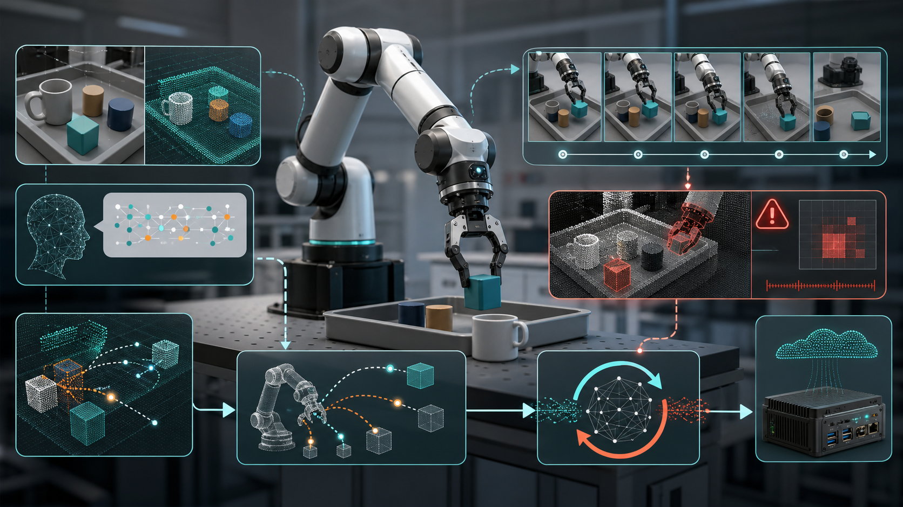

# Awesome VLA-WAM

A curated reading list for Vision-Language-Action (VLA) and World Action Model
(WAM) research, with an emphasis on:

- World Action Models for robotics.
- Failure detection, correction, feedback, and recovery in VLA systems.
- Efficient VLA models, action tokenization, compression, and deployment.

  

This seed list was extracted from
[DravenALG/awesome-vla-wam](https://github.com/DravenALG/awesome-vla-wam)
and reorganized around the three directions above. The failure
detection/correction section is not a one-to-one heading in the source
repository; it groups papers that are closely related through environment
feedback, self-improvement, verification, closed-loop learning, preference
alignment, online planning, or robustness evaluation.

## Contents

- [Surveys and Definitions](#surveys-and-definitions)
- [World Action Models](#world-action-models) ([full archive](WORLD_ACTION_MODELS.md))
- [VLA Failure Detection and Correction](#vla-failure-detection-and-correction) ([full archive](VLA_FAILURE_DETECTION_AND_CORRECTION.md))
- [Efficient VLA](#efficient-vla) ([full archive](EFFICIENT_VLA.md))
- [Benchmarks for Robustness and Evaluation](#benchmarks-for-robustness-and-evaluation)
- [Contributing](#contributing)

Section badges indicate the last curated refresh date for each category.
The main paper sections below show the latest 10 entries for each direct
list or subsection, sorted by available arXiv date/id. Full retained lists are
kept in the linked archive documents.

## Surveys and Definitions 

- **World Action Models: The Next Frontier in Embodied AI.**  
- **RT-2**, RT-2: Vision-Language-Action Models Transfer Web Knowledge to Robotic Control.  
- **DreamZero**, World Action Models are Zero-shot Policies.  
- **Vision-Language-Action (VLA) Models: Concepts, Progress, Applications and Challenges.**  
- **A Survey on Vision-Language-Action Models for Embodied AI.**  

## World Action Models 

Full archive: [World Action Models](WORLD_ACTION_MODELS.md).

### Video-Generation-Based WAM 

- **WorldVLN**, WorldVLN: Autoregressive World Action Model for Aerial Vision-Language Navigation.  
- **HarmoWAM**, HarmoWAM: Harmonizing Generalizable and Precise Manipulation via Adaptive World Action Models. 
- **NoiseGate**, NoiseGate: Learning Per-Latent Timestep Schedules as Information Gating in World Action Models. 
- **OA-WAM**, OA-WAM: Object-Addressable World Action Model for Robust Robot Manipulation. 
- **MotuBrain**, MotuBrain: An Advanced World Action Model for Robot Control.  
- **GigaWorld-Policy**, GigaWorld-Policy: An Efficient Action-Centered World-Action Model.  
- **Fast-WAM**, Fast-WAM: Do World Action Models Need Test-time Future Imagination?  
- **DreamZero**, World Action Models are Zero-shot Policies.  
- **World-VLA-Loop**, World-VLA-Loop: Closed-Loop Learning of Video World Model and VLA Policy.  
- **Lingbot-VA**, Causal World Modeling for Robot Control.  

### VLM-Based WAM 

- **WLA**, World-Language-Action Model for Unified World Modeling, Language Reasoning, and Action Synthesis. 
- **CKT-WAM**, CKT-WAM: Parameter-Efficient Context Knowledge Transfer Between World Action Models.  
- **World-Value-Action Model**, World-Value-Action Model: Implicit Planning for Vision-Language-Action Systems. 
- **WoG**, World Guidance World Modeling in Condition Space for Action Generation.  
- **VLAW**, VLAW: Iterative Co-Improvement of Vision-Language-Action Policy and World Model.  
- **VLA-JEPA**, VLA-JEPA: Enhancing Vision-Language-Action Model with Latent World Model.  
- **MM-ACT**, MM-ACT: Learn from Multimodal Parallel Generation to Act.  
- **RynnVLA-002**, RynnVLA-002: A Unified Vision-Language-Action and World Model.  
- **F1**, F1: A Vision-Language-Action Model Bridging Understanding and Generation to Actions.  
- **FlowVLA**, FlowVLA: Visual Chain of Thought-based Motion Reasoning for Vision-Language-Action Models.  
- **DreamVLA**, DreamVLA: A Vision-Language-Action Model Dreamed with Comprehensive World Knowledge.  

### WAM from Scratch and Latent Dynamics 

- **JOPAT**, Point Tracking Improves World Action Models. 
- **STARRY**, STARRY: Spatial-Temporal Action-Centric World Modeling for Robotic Manipulation. 
- **DexWorldModel**, DexWorldModel: Causal Latent World Modeling towards Automated Learning of Embodied Tasks. 
- **WAV**, World Action Verifier: Self-Improving World Models via Forward-Inverse Asymmetry.  
- **Enhancing Policy Learning with WAM**, Enhancing Policy Learning with World-Action Model. 
- **LeWorldModel**, LeWorldModel: Stable End-to-End Joint-Embedding Predictive Architecture from Pixels.  
- **Explicit World Model**, Building Explicit World Model for Zero-Shot Open-World Object Manipulation.  
- **LPS**, Latent Policy Steering with Embodiment-Agnostic Pretrained World Models. 
- **UWM**, Unified World Models: Coupling Video and Action Diffusion for Pretraining on Large Robotic Datasets.  
- **UVAM**, Unified Video Action Model.  

## VLA Failure Detection and Correction 

Full archive: [VLA Failure Detection and Correction](VLA_FAILURE_DETECTION_AND_CORRECTION.md).

These papers are useful entry points for failure-aware VLA systems, especially
when the method uses feedback, online adaptation, closed-loop correction,
self-evaluation, or policy/world-model co-improvement.

- **ADV**, Action Draft and Verify: A Self-Verifying Framework for Vision-Language-Action Model. 
- **pi0-EqM**, pi0-EqM: Equilibrium Matching for Closed-Loop Vision-Language-Action Control. 
- **Pre-VLA**, Pre-VLA: Preemptive Runtime Verification for Reliable Vision-Language-Action and World-Model Rollouts. 
- **StableVLA**, StableVLA: Towards Robust Vision-Language-Action Models without Extra Data. 
- **Health-Conditioned VLA**, Health-Conditioned Vision-Language-Action Models for Malfunction-Aware Robot Control.  
- **VLAs-as-Tools**, Towards Long-horizon Embodied Agents with Tool-Aligned Vision-Language-Action Models. 
- **A3**, Dynamic Execution Commitment of Vision-Language-Action Models. 
- **RePO-VLA**, RePO-VLA: Recovery-Driven Policy Optimization for Vision-Language-Action Models. 
- **Failing Forward**, Failing Forward: Adaptive Failure-Informed Learning for Vision-Language-Action Models. 
- **AT-VLA**, AT-VLA: Adaptive Tactile Injection for Enhanced Feedback Reaction in Vision-Language-Action Models.  
- **When to Trust Imagination**, When to Trust Imagination: Adaptive Action Execution for World Action Models. 

## Efficient VLA 

Full archive: [Efficient VLA](EFFICIENT_VLA.md).

### Compression, Adaptation, and Model Merging 

- **Omega-QVLA**, Ω-QVLA: Robust Quantization for Vision-Language-Action Models via Composite Rotation and Per-step Scaling.  
- **EXPO-FT**, EXPO-FT: Sample-Efficient Reinforcement Learning Finetuning for Vision-Language-Action Models. 
- **Agentic-VLA**, Agentic-VLA: Efficient Online Adaptation for Vision-Language-Action Models. 
- **DA-PTQ**, DA-PTQ: Drift-Aware Post-Training Quantization for Efficient Vision-Language-Action Models. 
- **DyQ-VLA**, DyQ-VLA: Temporal-Dynamic-Aware Quantization for Embodied Vision-Language-Action Models. 
- **QuantVLA**, QuantVLA: Scale-Calibrated Post-Training Quantization for Vision-Language-Action Models.  
- **HBVLA**, HBVLA: Pushing 1-Bit Post-Training Quantization for Vision-Language-Action Models. 
- **MergeVLA**, MergeVLA: Cross-Skill Model Merging Toward a Generalist Vision-Language-Action Agent.  
- **VLA-Adapter**, VLA-Adapter: An Effective Paradigm for Tiny-Scale Vision-Language-Action Model.  
- **FLOWER**, FLOWER: Democratizing Generalist Robot Policies with Efficient Vision-Language-Action Flow Policies.  

### Tokenization, Fine-Tuning, and Deployment-Friendly VLAs 

- **ElegantVLA**, ElegantVLA: Learning When to Think for Efficient Vision-Language-Action Models. 
- **CrossVLA**, Cross-Paradigm Post-Training and Inference Optimization for Vision-Language-Action Models.  
- **VLA-AD**, Offline Semantic Guidance for Efficient Vision-Language-Action Policy Distillation. 
- **Realtime-VLA FLASH**, Realtime-VLA FLASH: Speculative Inference Framework for Diffusion-based VLAs. 
- **Premover**, Premover: Fast Vision-Language-Action Control by Acting Before Instructions Are Complete. 
- **OneWM-VLA**, One Token Per Frame: Reconsidering Visual Bandwidth in World Models for VLA Policy. 
- **ConsisVLA-4D**, ConsisVLA-4D: Advancing Spatiotemporal Consistency in Efficient 3D-Perception and 4D-Reasoning for Robotic Manipulation.  
- **Latent Bridge**, Latent Bridge: Feature Delta Prediction for Efficient Dual-System Vision-Language-Action Model Inference. 
- **PokeVLA**, PokeVLA: Empowering Pocket-Sized Vision-Language-Action Model with Comprehensive World Knowledge Guidance.  
- **A1**, A1: A Fully Transparent Open-Source, Adaptive and Efficient Truncated Vision-Language-Action Model. 
- **Compression Gap**, The Compression Gap: Why Discrete Tokenization Limits Vision-Language-Action Model Scaling.  

## Benchmarks for Robustness and Evaluation 

- **LIBERO-Plus**, LIBERO-Plus: In-depth Robustness Analysis of Vision-Language-Action Models.  
- **WorldArena**, WorldArena: A Unified Benchmark for Evaluating Perception and Functional Utility of Embodied World Models.  
- **RoboArena**, RoboArena: Distributed Real-World Evaluation of Generalist Robot Policies.  
- **RoboTwin 2.0**, RoboTwin 2.0: A Scalable Data Generator and Benchmark with Strong Domain Randomization for Robust Bimanual Robotic Manipulation.  
- **SimplerEnv**, Evaluating Real-World Robot Manipulation Policies in Simulation.  
- **LIBERO**, LIBERO: Benchmarking Knowledge Transfer for Lifelong Robot Learning.  

## Contributing

Pull requests are welcome. A good entry should include:

- Paper or project name.
- Full title.
- arXiv, paper, project, or code link.
- One suggested category.
- Optional note explaining why it belongs in that category.

## Acknowledgements

Initial paper entries were reorganized from
[DravenALG/awesome-vla-wam](https://github.com/DravenALG/awesome-vla-wam).
