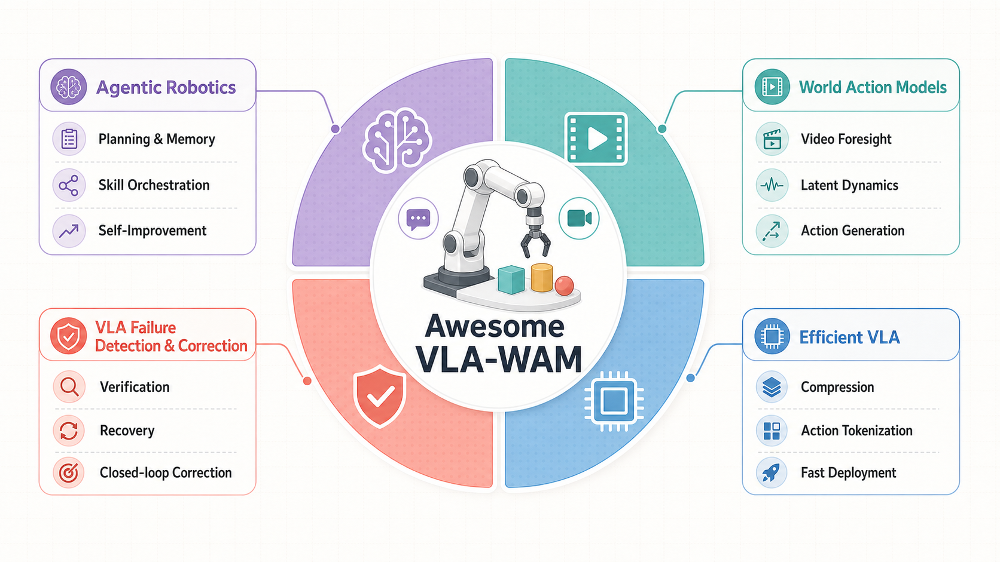
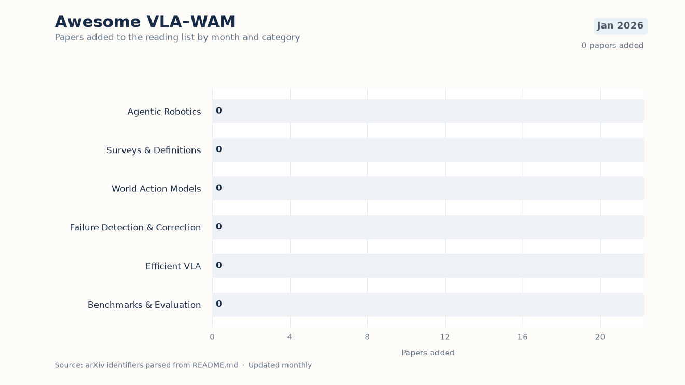

# Awesome VLA–WAM

  <strong>Vision-Language-Action · World Action Models · Agentic Robotics</strong> 
  <em>A curated, quality-gated reading list for embodied intelligence.</em>

  
  
  

  

  

The animation tracks papers added since January 2026. It is regenerated from
the arXiv identifiers in this README with
[`scripts/generate_monthly_paper_chart.py`](scripts/generate_monthly_paper_chart.py).

## Curation Policy

> **Core lists:** Every primary paper table or subsection in this README keeps
> exactly the 10 newest qualifying papers, ordered by available arXiv date or
> identifier. The linked archive documents retain the longer historical lists.
>
> **Reference lists:** Surveys and Definitions, and Benchmarks for Robustness
> and Evaluation, are compact reference sections and may contain fewer than 10
> entries when fewer items are retained.
>
> **Relevance:** ⭐⭐⭐ direct fit · ⭐⭐ adjacent/supporting · ⭐ background/context.

The agentic robotics section requires an explicit embodied-agent layer that
coordinates multi-step physical execution through high-level planning, memory,
tool or skill discovery and composition, VLA/VLM or policy orchestration,
recovery, or online policy self-improvement. Pure navigation or VLN policies
without another agentic robotics capability are out of scope. Standalone prompt
optimization, generic exploration, or low-level VLA improvements without this
agent-level role are also out of scope.
The failure
detection/correction section is not a one-to-one heading in the source
repository; it groups papers that are closely related through environment
feedback, self-improvement, verification, closed-loop learning, preference
alignment, online planning, or robustness evaluation.

## Contents

| Section | Focus | Archive |
| --- | --- | --- |
| [Agentic Robotics](#agentic-robotics-new-trend) | Long-horizon embodied agents, tools, skills, and orchestration | [10+ historical entries](AGENTIC_ROBOTICS.md) |
| [Surveys and Definitions](#surveys-and-definitions) | Roadmaps, reviews, and shared terminology | — |
| [World Action Models](#world-action-models) | Predictive world-action modeling for robotics | [Historical lists](WORLD_ACTION_MODELS.md) |
| [VLA Failure Detection and Correction](#vla-failure-detection-and-correction) | Feedback, verification, recovery, and online adaptation | [Historical entries](VLA_FAILURE_DETECTION_AND_CORRECTION.md) |
| [Efficient VLA](#efficient-vla) | Compression, tokenization, fine-tuning, and deployment | [Historical lists](EFFICIENT_VLA.md) |
| [Benchmarks and Evaluation](#benchmarks-for-robustness-and-evaluation) | Robustness and evaluation resources | — |

Section badges show the latest curation date. Core paper lists below keep the
10 newest entries; reference sections may be shorter.

## Agentic Robotics (New Trend) 

Full archive: [Agentic Robotics](AGENTIC_ROBOTICS.md).

This emerging line treats robot foundation models as components inside a
broader embodied-agent loop. Papers belong here only when the agent layer is
central to coordinating physical multi-step execution through planning,
memory, tool or skill composition, policy orchestration, recovery, or online
self-improvement; pure navigation-only or VLN policies are out of scope.

| Paper | Title | Links | Relevance |
| --- | --- | --- | --- |
| Agentic RSR | Agentic RSR: Real-to-Sim-to-Real through Scene Reconstruction and Execution-Grounded Robot Policies. | [arXiv](https://arxiv.org/abs/2610.10479) | ⭐⭐⭐ |
| OntoPlan | OntoPlan: An Ontology-Grounded Scene Representation and Agentic Framework for Scalable Robot Task Planning. | [arXiv](https://arxiv.org/abs/2610.07649) | ⭐⭐⭐ |
| RV-ICL | Recursive Video In-Context Learning for Agentic Robot. | [arXiv](https://arxiv.org/abs/2610.06843) | ⭐⭐⭐ |
| MobiAgent | MobiAgent: Dual-Loop Recursive Policy Self-Improvement for Long-Horizon Mobile Manipulation. | [arXiv](https://arxiv.org/abs/2610.03476) · [Project](https://kaiknower.github.io) | ⭐⭐⭐ |
| DynaHarness | DynaHarness: A Dynamic Physical Harness for Self-Evolving Robot Agents. | [arXiv](https://arxiv.org/abs/2609.40306) · [Project](https://denghaoyuan123.github.io/) | ⭐⭐⭐ |
| Skill-Space Shooting | Skill-Space Shooting for Autonomous Robot Policy Improvement. | [arXiv](https://arxiv.org/abs/2609.38178) · [Project](https://skill-space-shooting.github.io/) | ⭐⭐⭐ |
| CognitiveReality | CognitiveReality: Robot-Agnostic Semantic Gaussian Mapping with an LLM Agent for Immersive Collaborative VR Teleoperation. | [arXiv](https://arxiv.org/abs/2609.31418) | ⭐⭐⭐ |
| RIVET | Representation-Guided Generation and Integration of Executable Programs for Robot Manipulation. | [arXiv](https://arxiv.org/abs/2609.31337) | ⭐⭐⭐ |
| RAPID | RAPID: Robot Agentic Programming from Demonstrations. | [arXiv](https://arxiv.org/abs/2609.30249) · [Project](https://yuyaoliu.me) | ⭐⭐⭐ |
| TANDEM | TANDEM: Task and Motion Planning with As-Needed Demonstrations for Efficient Vision-Language-Action Model Fine-tuning. | [arXiv](https://arxiv.org/abs/2609.28314) | ⭐⭐⭐ |

## Surveys and Definitions 

| Paper | Title | Links | Relevance |
| --- | --- | --- | --- |
| Embodied Brains Roadmap | From World Action Models to Embodied Brains: A Roadmap for Open-World Physical Intelligence. | [arXiv](https://arxiv.org/abs/2607.11689) | ⭐⭐⭐ |
| VLA Review: UAV and Bimanual | Vision Language Action (VLA) Models for Unmanned Aerial Robotics and Bimanual Manipulation: A Review. | [arXiv](https://arxiv.org/abs/2607.06706) | ⭐⭐⭐ |
| World Action Models Tutorial | From World Models to World Action Models: A Concise Tutorial for Robotics. | [arXiv](https://arxiv.org/abs/2607.00836) · [Website](https://clearlab-sustech.github.io/WorldModelSurvey/) · [Code](https://github.com/clearlab-sustech/WorldModelSurvey) | ⭐⭐⭐ |
| World Model for Robot Learning | World Model for Robot Learning: A Comprehensive Survey. | [arXiv](https://arxiv.org/abs/2605.00080) · [Website](https://ntumars.github.io/wm-robot-survey/) · [Code](https://github.com/NTUMARS/Awesome-World-Model-for-Robotics-Policy) | ⭐⭐⭐ |
| Embodied Agentic AI | Towards Embodied Agentic AI: Review and Classification of LLM- and VLM-Driven Robot Autonomy and Interaction. | [arXiv](https://arxiv.org/abs/2508.05294) | ⭐⭐⭐ |

## World Action Models 

Full archive: [World Action Models](WORLD_ACTION_MODELS.md).

### Robustness and Security 

| Paper | Title | Links | Relevance |
| --- | --- | --- | --- |
| TAPDreamer | TAPDreamer: Transferable Adversarial Patches for World Action Models. | [arXiv](https://arxiv.org/abs/2610.06814) · [Project](https://tapdreamer.github.io/) | ⭐⭐⭐ |

### Video-Generation-Based WAM 

| Paper | Title | Links | Relevance |
| --- | --- | --- | --- |
| Rolling-WAM | Rolling-WAM: World Action Models with Rolling Imagination. | [arXiv](https://arxiv.org/abs/2609.30247) · [Project](https://rolling-wam.github.io/) | ⭐⭐⭐ |
| CLAP | CLAP: Cross-Embodiment Video World Models are Zero-Shot Physical Simulators. | [arXiv](https://arxiv.org/abs/2608.27406) · [Project](https://omni-clap.github.io/) | ⭐⭐⭐ |
| TacPAC | TacPAC: Tactile Prediction and Real-Time Action Correction in World-Action Models for Contact-Rich Manipulation. | [arXiv](https://arxiv.org/abs/2609.05266) · [Code](https://github.com/LogosRoboticsGroup/TacPAC) | ⭐⭐⭐ |
| SV-WAM | SV-WAM: An Efficient Surround-View World-Action Model for End-to-End Autonomous Driving. | [arXiv](https://arxiv.org/abs/2609.03602) | ⭐⭐⭐ |
| SA-WAM | Spatially Aware World Action Model via Geometric Latent Diffusion. | [arXiv](https://arxiv.org/abs/2609.02531) | ⭐⭐⭐ |
| IMPACT | IMPACT: Attention Is the Interaction Map for Scalable Interaction-Aware World Model Training. | [arXiv](https://arxiv.org/abs/2609.00161) | ⭐⭐⭐ |
| AcrossVAM1.0 | AcrossVAM1.0: Particle World Modeling for Text-Assisted Robot Video Prediction. | [arXiv](https://arxiv.org/abs/2608.28491) | ⭐⭐⭐ |
| Zero-WAM | Zero-WAM: In-Context World-Action Modeling from Human Videos for Open-Ended Task Generalization. | [arXiv](https://arxiv.org/abs/2608.26103) · [Project](https://robbyant-research.github.io/) | ⭐⭐⭐ |
| WorldSync | Do Robotic World Models Really Follow Actions? Diagnosing and Aligning Action-Conditioned Generation for Policy Learning. | [arXiv](https://arxiv.org/abs/2608.24885) | ⭐⭐⭐ |
| Surgical WAM | Surgical WAM: A World-Action Model for Data-Efficient Surgical Robot Learning. | [arXiv](https://arxiv.org/abs/2608.11204) | ⭐⭐⭐ |

### VLM-Based WAM 

| Paper | Title | Links | Relevance |
| --- | --- | --- | --- |
| ForeTime-VLA | ForeTime-VLA: Causal Future-Token Distillation from a World Action Model for Conveyor-Belt Manipulation. | [arXiv](https://arxiv.org/abs/2608.20735) | ⭐⭐⭐ |
| HyWorldVLA | HyWorldVLA: A Vision-Language-Action Model with Hybrid World Modeling for Autonomous Driving. | [arXiv](https://arxiv.org/abs/2607.20988) | ⭐⭐⭐ |
| DSWAM | DSWAM: A Dual-System World Action Foundation Model for Fine-Grained Robot Manipulation. | [arXiv](https://arxiv.org/abs/2607.04927) | ⭐⭐⭐ |
| FutureNav | FutureNav: Unified World-Action Modeling for Vision-and-Language Navigation. | [arXiv](https://arxiv.org/abs/2606.30367) | ⭐⭐⭐ |
| WLA | World-Language-Action Model for Unified World Modeling, Language Reasoning, and Action Synthesis. | [arXiv](https://arxiv.org/abs/2606.05979) · [Website](https://github.com/SJTU-DENG-Lab/WLA) | ⭐⭐⭐ |
| CKT-WAM | CKT-WAM: Parameter-Efficient Context Knowledge Transfer Between World Action Models. | [arXiv](https://arxiv.org/abs/2605.06247) · [Website](https://github.com/YuhuaJiang2002/CKT-WAM) | ⭐⭐ |
| World-Value-Action Model | World-Value-Action Model: Implicit Planning for Vision-Language-Action Systems. | [arXiv](https://arxiv.org/abs/2604.14732) | ⭐⭐⭐ |
| WoG | World Guidance World Modeling in Condition Space for Action Generation. | [arXiv](https://arxiv.org/abs/2602.22010) · [Website](https://selen-suyue.github.io/WoGNet/) | ⭐⭐ |
| VLAW | VLAW: Iterative Co-Improvement of Vision-Language-Action Policy and World Model. | [arXiv](https://arxiv.org/abs/2602.12063) · [Website](https://sites.google.com/view/vlaw-arxiv) | ⭐⭐⭐ |
| VLA-JEPA | VLA-JEPA: Enhancing Vision-Language-Action Model with Latent World Model. | [arXiv](https://arxiv.org/abs/2602.10098) · [Website](https://ginwind.github.io/VLA-JEPA/) | ⭐⭐⭐ |

### WAM from Scratch and Latent Dynamics 

| Paper | Title | Links | Relevance |
| --- | --- | --- | --- |
| Long-WAM | Long-WAM: Scaling the Context of World-Action Models. | [arXiv](https://arxiv.org/abs/2610.10528) | ⭐⭐⭐ |
| OpenWAM | OpenWAM: An Open Framework for Composable World-Action Models. | [arXiv](https://arxiv.org/abs/2610.07922) · [Project](https://openwam.stanford.edu/) · [Code](https://github.com/OpenWAM/OpenWAM) | ⭐⭐⭐ |
| XGenAct | XGenAct: Geometry-Enhanced World Action Models through Cross-Task Generation. | [arXiv](https://arxiv.org/abs/2610.03516) | ⭐⭐⭐ |
| Ego4WAM | Ego4WAM: What Matters When Scaling Egocentric Human Data for Robot Learning? | [arXiv](https://arxiv.org/abs/2609.40341) | ⭐⭐⭐ |
| MVG-WAM | MVG-WAM: Multiple View Geometry-Aware World-Action Modeling for Robotic Manipulation. | [arXiv](https://arxiv.org/abs/2609.37793) · [Project](https://bobc-123.github.io/MVG-WAM/) | ⭐⭐⭐ |
| InternW0-Δ | InternW0-Δ: A World Action Model Bridging Predictive Dynamics and Actions with 20K+ Hours of Open Data. | [arXiv](https://arxiv.org/abs/2609.31394) · [Project](https://internrobotics.github.io/InternW0-Delta/) | ⭐⭐⭐ |
| AD-WM | AD-WM: Action-Discriminative World Models for Counterfactual Model Predictive Control. | [arXiv](https://arxiv.org/abs/2609.30264) · [Project](https://ad-wm.github.io/) | ⭐⭐⭐ |
| PointCast | PointCast: One World Model for Rigid, Articulated, and Deformable Object Manipulation. | [arXiv](https://arxiv.org/abs/2609.28393) · [Project](https://pointcast-wm.github.io) | ⭐⭐⭐ |
| DexTacWAM | DexTacWAM: A Visuo-Tactile World-Action Model for Dexterous Manipulation. | [arXiv](https://arxiv.org/abs/2609.24976) · [Project](https://dextacwam.github.io/) | ⭐⭐⭐ |
| SkelWAM | SkelWAM: A Skeleton-Guided World-Action Model for Zero-Shot Cross-Embodiment Manipulation. | [arXiv](https://arxiv.org/abs/2609.21983) · [Project](http://www.liukepku.com/skelwam/index.html) | ⭐⭐⭐ |

## VLA Failure Detection and Correction 

Full archive: [VLA Failure Detection and Correction](VLA_FAILURE_DETECTION_AND_CORRECTION.md).

These papers are useful entry points for failure-aware VLA systems, especially
when the method uses feedback, online adaptation, closed-loop correction,
self-evaluation, or policy/world-model co-improvement.

| Paper | Title | Links | Relevance |
| --- | --- | --- | --- |
| RoboPrompt | RoboPrompt: Intuitive Robot Policy Steering with Sparse Human Input. | [arXiv](https://arxiv.org/abs/2610.10534) | ⭐⭐⭐ |
| SALT | Adapting Vision-Language-Action Models to Unknown Visual Disruptions During Execution. | [arXiv](https://arxiv.org/abs/2610.07946) | ⭐⭐⭐ |
| VLA-ZO | VLA-ZO: Fast Zeroth-Order Adaptation for Vision-Language-Action Models. | [arXiv](https://arxiv.org/abs/2610.06271) | ⭐⭐⭐ |
| Detect and Suppress | Detect and Suppress: A Mechanistic Defense against Adversarial Patches in VLA Models. | [arXiv](https://arxiv.org/abs/2610.03498) | ⭐⭐⭐ |
| Multi-Link Safety Filtering | Multi-Link Safety Filtering for VLA Policies Around Moving Hazards. | [arXiv](https://arxiv.org/abs/2609.40007) · [Project](https://yathag.github.io/) | ⭐⭐⭐ |
| Rho | Rho: A Foundation for Efficiently Adaptable VLA Models. | [arXiv](https://arxiv.org/abs/2609.38164) | ⭐⭐⭐ |
| Kintsugi-VLA | Kintsugi-VLA: Turning Failed Robot Rollouts into Recovery Data through Interventional Recoverability. | [arXiv](https://arxiv.org/abs/2609.31048) | ⭐⭐⭐ |
| Self-Adaptive VLA | Self-Adaptive VLA for Robust Robot Deployment. | [arXiv](https://arxiv.org/abs/2609.30092) · [Project](https://icefoxzhx.github.io/) | ⭐⭐⭐ |
| CereVLA | CereVLA: Cerebellum-Inspired Consequence-Aware Residual Governance for Efficient Vision-Language-Action Execution. | [arXiv](https://arxiv.org/abs/2609.27468) | ⭐⭐⭐ |
| CARE | CARE: Experience-Guided Atomic Corrective Execution for Vision-Language-Action Policies. | [arXiv](https://arxiv.org/abs/2609.24118) · [Code](https://github.com/xiaojunlan/care) | ⭐⭐⭐ |

## Efficient VLA 

Full archive: [Efficient VLA](EFFICIENT_VLA.md).

### Compression, Adaptation, and Model Merging 

| Paper | Title | Links | Relevance |
| --- | --- | --- | --- |
| ActTune | ActTune: Action-Aware Precision and GPU Operating-Point Adaptation for Energy-Efficient Vision-Language-Action Inference. | [arXiv](https://arxiv.org/abs/2610.08444) | ⭐⭐⭐ |
| VLA-ZO | VLA-ZO: Fast Zeroth-Order Adaptation for Vision-Language-Action Models. | [arXiv](https://arxiv.org/abs/2610.06271) | ⭐⭐⭐ |
| Rho | Rho: A Foundation for Efficiently Adaptable VLA Models. | [arXiv](https://arxiv.org/abs/2609.38164) | ⭐⭐⭐ |
| FRAM | FRAM: Trajectory-Guided Visual Feature Selection for Compact Language-Conditioned Robot Manipulation. | [arXiv](https://arxiv.org/abs/2609.30965) | ⭐⭐⭐ |
| ε4P | Imperfection for Precision: Upcycling Imperfect Data for High-Precision Robotic Manipulation. | [arXiv](https://arxiv.org/abs/2609.26672) · [Project](https://varepsilon4p.github.io/) | ⭐⭐⭐ |
| AdaDE | Dense to MoE Adaptation for Compact Vision Language Action Policies. | [arXiv](https://arxiv.org/abs/2609.16503) | ⭐⭐⭐ |
| Beyond Data Scaling | Beyond Data Scaling: Representation-Centric Continued Pre-training for Vision-Language-Action Models. | [arXiv](https://arxiv.org/abs/2608.27550) · [Project](https://starvla.github.io/) | ⭐⭐⭐ |
| GVLA | Gripper-aware Vision Language Action Models. | [arXiv](https://arxiv.org/abs/2608.24603) | ⭐⭐⭐ |
| Action-JND | Just Noticeable Difference Modeling for Token Compression in Vision-Language-Action Models. | [arXiv](https://arxiv.org/abs/2608.21247) | ⭐⭐⭐ |
| BridgeVLA++ | BridgeVLA++: A Data-Efficient, Generalizable, and Memory-Augmented Vision-Language-Action Framework for 3D Manipulation. | [arXiv](https://arxiv.org/abs/2608.05042) · [Code](https://github.com/BridgeVLA/BridgeVLA) | ⭐⭐⭐ |

### Tokenization, Fine-Tuning, and Deployment-Friendly VLAs 

| Paper | Title | Links | Relevance |
| --- | --- | --- | --- |
| FastOPD | FastOPD: On-Policy Distillation for Lightweight VLA Deployment. | [arXiv](https://arxiv.org/abs/2610.02832) · [Project](https://fastopd.github.io) | ⭐⭐⭐ |
| Discrete Forcing | Discrete Forcing: Infusing Discrete Guidance into Continuous Denoising for Few-Step Action Experts. | [arXiv](https://arxiv.org/abs/2609.39526) | ⭐⭐⭐ |
| Decoupled Early Exits | Decoupled Early Exits for Task-Dependent Compute Allocation in Flow-Matching VLAs. | [arXiv](https://arxiv.org/abs/2609.29382) | ⭐⭐⭐ |
| Think Like a World Model | Think Like a World Model, Act Like a VLA: Distilling World-Model Representations into Compact Robot Policies. | [arXiv](https://arxiv.org/abs/2609.24682) · [Project](https://thaw-vla.trung-dt.com/) | ⭐⭐⭐ |
| Coda | Fewer Steps, Better Actions: Rethinking Flow-Matching Inference for VLA Policies. | [arXiv](https://arxiv.org/abs/2609.21216) | ⭐⭐⭐ |
| GeoAAC | GeoAAC: Geometry-Based Adaptive Action Chunking from Denoising Trajectories in VLA Policies. | [arXiv](https://arxiv.org/abs/2609.20776) | ⭐⭐⭐ |
| rMuscle | rMuscle: Robotic Muscle Memory for Efficient Vision-Language-Action Model Inference. | [arXiv](https://arxiv.org/abs/2609.19104) | ⭐⭐⭐ |
| DiffAdapterVLA | Planning in the Backbone: DiffAdapterVLA for Native Continuous Trajectory Generation with Driving VLMs. | [arXiv](https://arxiv.org/abs/2609.15322) | ⭐⭐⭐ |
| Dynin-Robotics | Dynin-Robotics: Omnimodal Unified Diffusion Vision-Language-Action Model. | [arXiv](https://arxiv.org/abs/2609.13053) · [Project](https://dynin.ai/robotics/) · [Code](https://github.com/AIDASLab/Dynin-Robotics) | ⭐⭐⭐ |
| IMLE-VLA | IMLE-VLA: Fast Single-Step Action Generation for Vision-Language-Action Policies. | [arXiv](https://arxiv.org/abs/2609.10915) · [Project](https://kianhk6.github.io/) | ⭐⭐⭐ |

## Benchmarks for Robustness and Evaluation 

| Paper | Title | Links | Relevance |
| --- | --- | --- | --- |
| WorldArena | WorldArena: A Unified Benchmark for Evaluating Perception and Functional Utility of Embodied World Models. | [arXiv](https://arxiv.org/abs/2602.08971) · [Website](https://world-arena.ai) | ⭐⭐ |
| LIBERO-Plus | LIBERO-Plus: In-depth Robustness Analysis of Vision-Language-Action Models. | [arXiv](https://arxiv.org/abs/2510.13626) · [Website](https://sylvestf.github.io/LIBERO-plus/) | ⭐⭐⭐ |
| RoboArena | RoboArena: Distributed Real-World Evaluation of Generalist Robot Policies. | [arXiv](https://arxiv.org/abs/2506.18123) · [Website](https://robo-arena.github.io) | ⭐ |
| RoboTwin 2.0 | RoboTwin 2.0: A Scalable Data Generator and Benchmark with Strong Domain Randomization for Robust Bimanual Robotic Manipulation. | [arXiv](https://arxiv.org/abs/2506.18088) · [Website](https://github.com/robotwin-Platform/robotwin/) | ⭐⭐ |
| SimplerEnv | Evaluating Real-World Robot Manipulation Policies in Simulation. | [arXiv](https://arxiv.org/abs/2405.05941) · [Website](https://simpler-env.github.io) | ⭐ |
| LIBERO | LIBERO: Benchmarking Knowledge Transfer for Lifelong Robot Learning. | [arXiv](https://arxiv.org/abs/2306.03310) · [Website](https://libero-project.github.io/main.html) | ⭐ |

## Contributing

Pull requests are welcome. A good entry should include:

- Paper or project name.
- Full title.
- arXiv, paper, project, or code link.
- One suggested category.
- Optional note explaining why it belongs in that category.

For every curated update, keep the primary Codex author and add
`Co-authored-by: wangskyone <wangskyone@users.noreply.github.com>` to the
commit message.

## Acknowledgements

Initial paper entries were reorganized from
[DravenALG/awesome-vla-wam](https://github.com/DravenALG/awesome-vla-wam).
